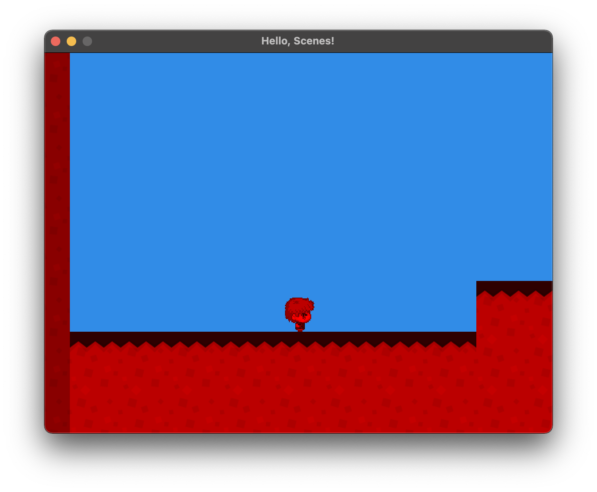
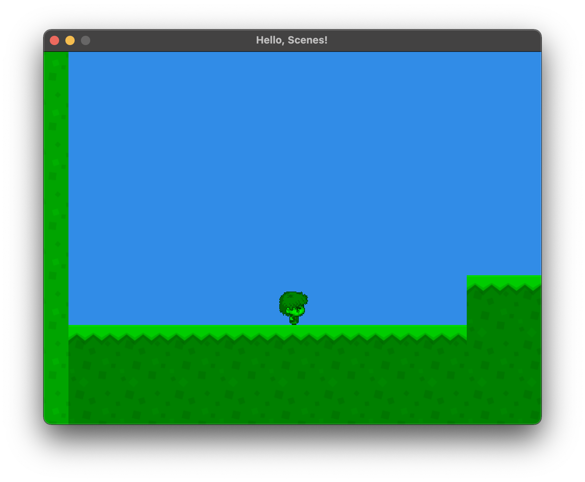
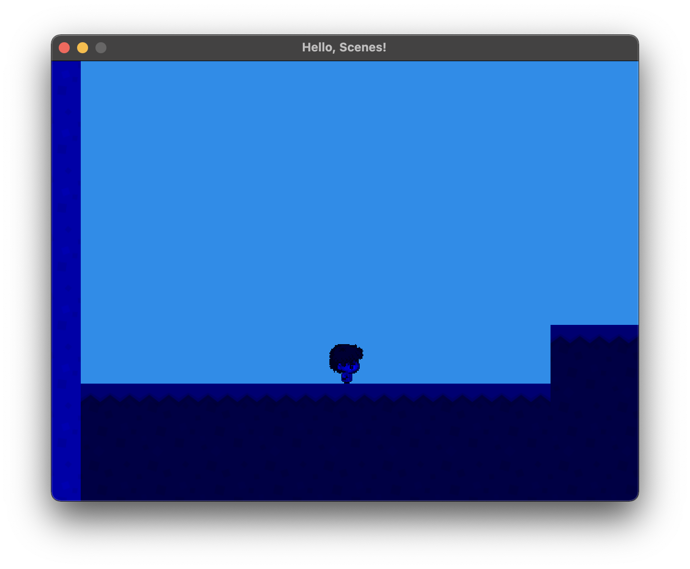
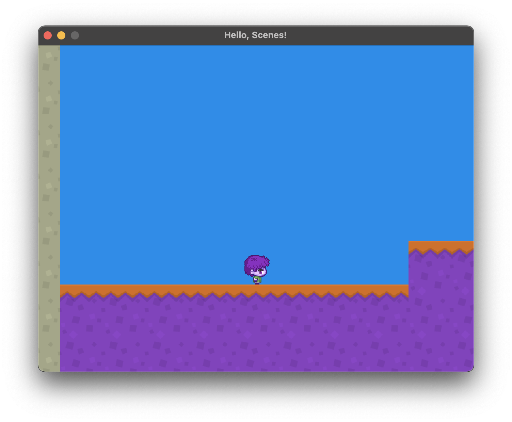
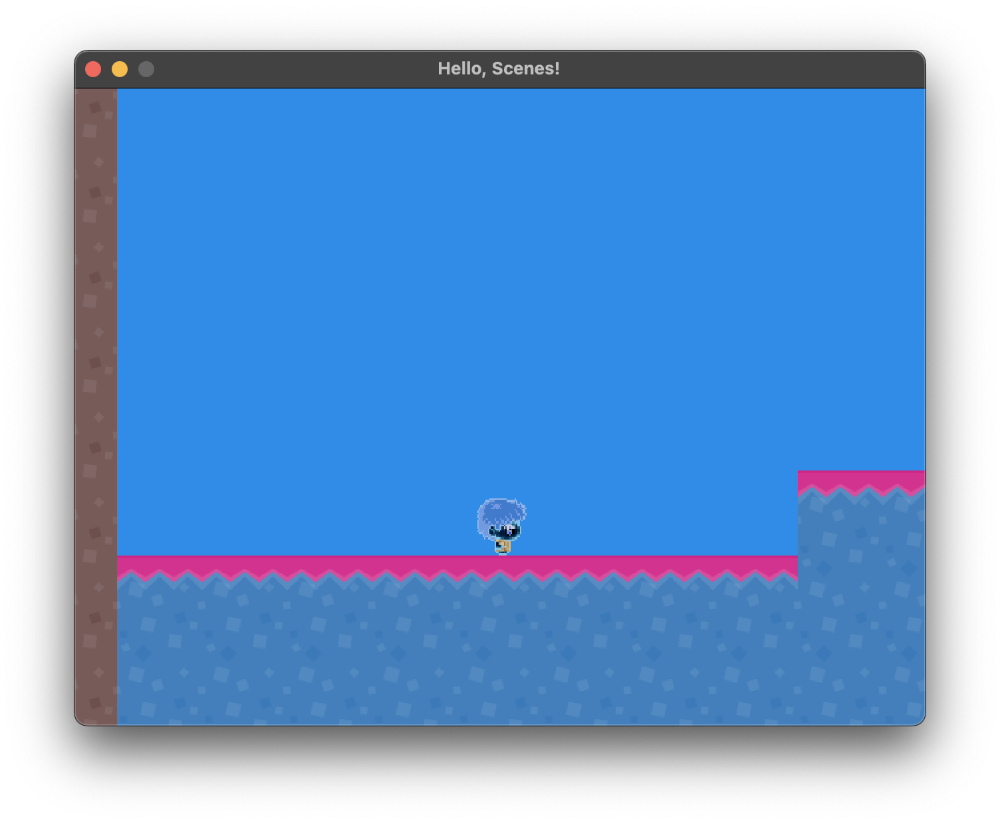
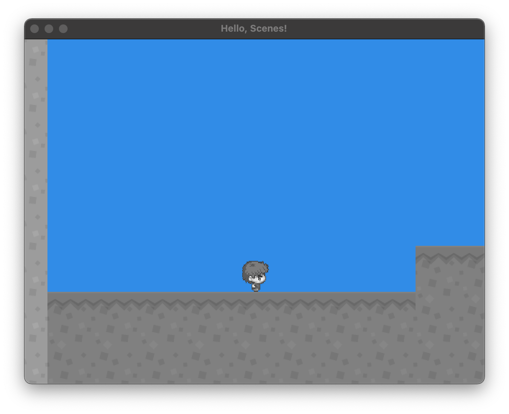
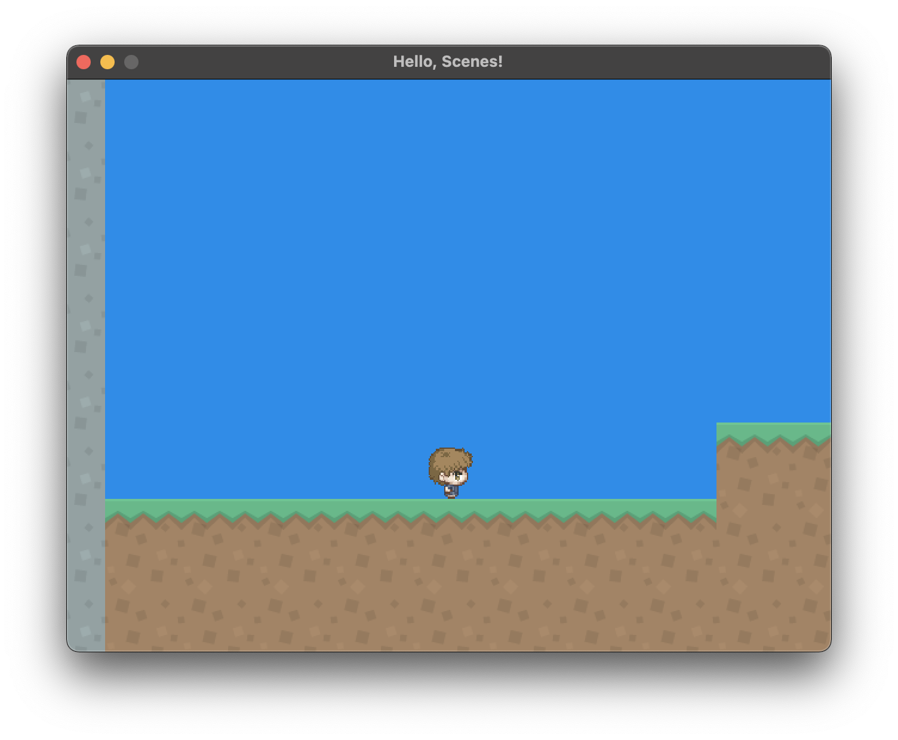
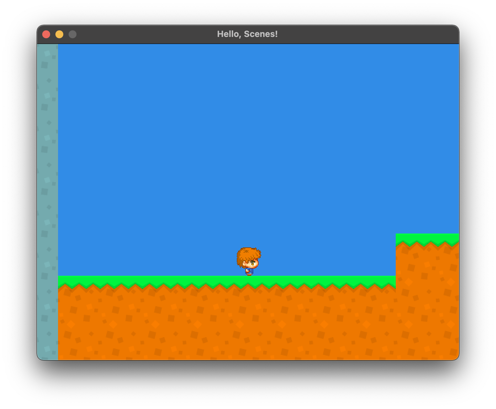
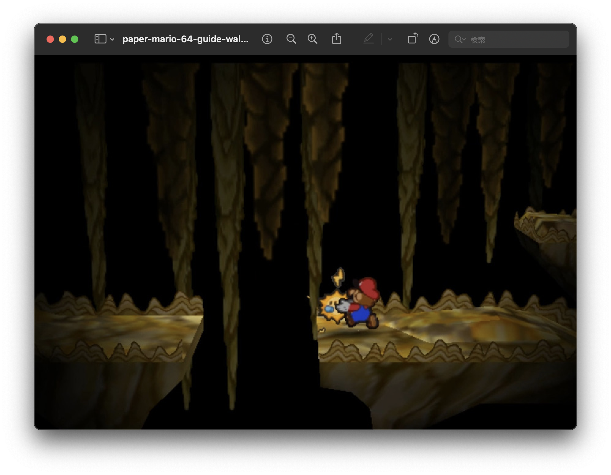

<h2 align=center>Week 09</h2>

<h1 align=center>Shaders</h1>

<h3 align=center>1 Red Wolf Moon, Imperial Year MMXXIV</h3>

<p align=center><strong><em>Song of the day</strong>: <a href="https://www.youtube.com/watch?v=phT2MJAn1KY&ab_channel=TOMORROWXTOGETHER-Topic"><strong><u>APT</u></strong></a> by ROSÉ & Bruno Mars (2024).</em></p>

---

### Sections

1. [**What exactly do shaders do?**](#1)
2. [**Experimenting with shaders**](#2)
3. [**2D Lighting**](#part-3-2d-lighting)

---

<a id="1"></a>

### Part 1: _What exactly do shaders do?_

From the very first day of class, we've been using these mysterious files that we call shaders. The only thing that we really have talked about thus far is that we have two kinds: the ones for untextured shapes, and one for textured ones. But what exactly are these things, and what can we do with them?

First, let's take a look at that code that uses them:

```c++
// Using these files is considered as loading the entire program by OpenGL
g_program.load("shaders/vertex_textured.glsl",
        "shaders/fragment_textured.glsl");

// Onto which we them set the projection, view, and model matrices
g_program.set_projection_matrix(g_projection_matrix);
g_program.set_view_matrix(g_view_matrix);
g_program.set_colour(1.0f, 1.0f, 1.0f, 1.0f);
g_program.set_model_matrix(g_model_matrix);

glUseProgram(g_program.get_program_id());
```

<sub>**Code Block 1**: Shaders are what we throw everything in our game into.</sub>

Shaders turn out to be kind of OpenGL's entire raison d'être—and of GPUs in general. All vertices, the transformations we apply onto them, and the colouring that they then display onto our screen are all due to these shaders, as they are integral parts of the GPU pipeline:

```
 +———————————————————+              +———————————————————+       +——————————————————————————————————————+
 | Vertices          |------------> |   Vertex Shader   |       |                                      |
 +———————————————————+          /   +———————————————————+       |                                      |
 +———————————————————+         /              |                 |         +——————————————————+         |
 | Model Matrix      |--------/               V                 |         | SUPER MARIO BROS |         |
 +———————————————————+       /      +———————————————————+       |         +——————————————————+         |
 +———————————————————+      /       |  Fragment Shader  | ----> |                                      |
 | View Matrix       |-----/        +———————————————————+       |                                      |
 +———————————————————+    /                                     |           > Start                    |
 +———————————————————+   /                                      |           > Settings                 |
 | Projection Matrix |--/                                       |                                      |
 +———————————————————+                                          +——————————————————————————————————————+
```

<sub>**Figure 1**: The GPU Timeline.</sub>

Looking at them individually:

> **Vertex Shader**: This shader translates the vertices that we feed into it to screen positions. 

```glsl
// Vertices and texture coordinates
attribute vec4 position;
attribute vec2 texCoord;

// Variables we can set direction from our code
uniform mat4 modelMatrix;
uniform mat4 viewMatrix;
uniform mat4 projectionMatrix;

// A variable that is passed from the vertex shader to the fragment shader
varying vec2 texCoordVar;

void main()
{
    vec4 p = viewMatrix * modelMatrix  * position;
    texCoordVar = texCoord;
    gl_Position = projectionMatrix * p;  // must be set
}
```

<sub>**Code Block 2**: The texture vertex shader. Notice that the view and model matrices are being applied onto the position of the vertex, which is then multiplied into the projection matrix.</sub>

> **Frament Shader**: For _each pixel_, the fragment shader determines exactly what colour to draw onto the screen. It does this by either grabbing a pixel/colour from a texture, or by interpolating by distance from the vertices. 

```glsl
uniform sampler2D diffuse;  // a texture
varying vec2 texCoordVar;   // the coordinate passed in from the vertex shader

void main()
{
    // The colour from teh texture based on the texture coordinates
    gl_FragColor = texture2D(diffuse, texCoordVar);
}
```

<sub>**Code Block 3**: The texture fragment shader.</sub>

You will notice that the extension for these files is `.glsl`. This an OpenGL specific C-like language, with its own reserved keywords like 

- [**`uniform`**](https://www.khronos.org/opengl/wiki/Uniform_(GLSL)): These act as parameters that the user of a shader program (i.e. OpenGL) can pass to that program.
- [**`varying`**](https://thebookofshaders.com/glossary/?search=varying): Data shared from a vertex shader to a fragment shader.
- [**`attribute`**](https://thebookofshaders.com/glossary/?search=attribute): Read-only variables containing data shared from OpenGL environment to the vertex shader.

<br>

<a id="2"></a>

### Part 2: _Experimenting with shaders_

Let's create a new file called [**`effects_textured.glsl`**](SDLProject/shaders/effects_textured.glsl), and use the code from [**`fragment_textured.glsl`**](SDLProject/shaders/fragment_textured.glsl) as a starting point. Let's see what happens if we mess around with the values that we set onto `gl_FragColor`:

```glsl
uniform sampler2D diffuse;
varying vec2 texCoordVar;

void main()
{
    vec4 colour = texture2D(diffuse, texCoordVar);
    gl_FragColor = vec4(colour.r, 0, 0, colour.a);
}
```

<sub>**Code Block 4**: Using only the red values.</sub>

Result:



<sub>**Figure 2**: Oh god, oh no.</sub>

We'll get similar results if we use only the green and blue values:



<sub>**Figure 3**: Only green values; `gl_FragColor = vec4(0, colour.g, 0, colour.a)`.</sub>



<sub>**Figure 4**: Only blue values; `gl_FragColor = vec4(0, 0, colour.b, colour.a)`.</sub>



<sub>**Figure 5**: Randomly switching values; `gl_FragColor = vec4(colour.g, colour.b, colour.r, colour.a)`.</sub>



<sub>**Figure 6**: Inverting values; `gl_FragColor = vec4(1.0 - colour.r, 1.0 - colour.g, 1.0 - colour.b, colour.a)`.</sub>

---

We can also take advantage of luminance, the intensity of light emitted from a surface, to get a basic greyscale palette:

```glsl
void main()
{
    vec4 colour = texture2D(diffuse, texCoordVar);
    float c = (colour.r + colour.g + colour.b) / 3.0;
    gl_FragColor = vec4(c, c, c, colour.a);
}
```

Output:



<sub>**Figure 7**: Basic greyscale is achieved by averaging all RGB values.</sub>

Though you can get something a little bit more "realistic" by doing the following:

```glsl
void main()
{
    vec4 colour = texture2D(diffuse, texCoordVar);
    vec3 luminance = vec3(dot(vec3(0.2126, 0.7152, 0.0722), colour.rgb));
    gl_FragColor = vec4(luminance, colour.a);
}
```


<sub>**Figure 8**: A more realistic greyscale. This is because human eyes perceive green a bit more than the other two colours.</sub>

By using basic interpolation math, we can get something in-between:

```glsl
void main()
{
    vec4 colour = texture2D(diffuse, texCoordVar);
    vec3 luminance = vec3(dot(vec3(0.2126, 0.7152, 0.0722), colour.rgb));
    vec3 m = mix(luminance, colour.rgb, 1.0);  // change this 1.0 to mess around with the interpolation
    
    gl_FragColor = vec4(m, colour.a);
}
```

<sub>**Code Block 5**: How to change luminance. The formula that `mix(a, b, w)` uses is `a * (1 − w) + b * w`.</sub>

For example, if we change `1.0` to `0.5`:



<sub>**Figure 9**: All around me are familiar faces.</sub>



<sub>**Figure 10**: Double luminance.</sub>

<br>

<a id="3"></a>

### Part 3: _2D Lighting_

Consider the following screenshot from [**Paper Mario 64**](https://en.wikipedia.org/wiki/Paper_Mario_(video_game))—arguably one of the best turn-based RPGs of all time:



<sub>**Figure 11**: Mario and Sparky.</sub>

When Mario has Sparky as his partner, he can has a light source follow him around in dark rooms. How difficult would this effect be with shaders? Turns out that it's not particularly complicated. The trick here is to check the distance from the light of each pixel adn, based on the light's attenuation, we decrease the brightness. For this, we use something called the [**inverse-square law**](https://en.wikipedia.org/wiki/Inverse-square_law); let's create a [**separate**](SDLProject/shaders/vertex_lit.glsl) [**set**](SDLProject/shaders/fragment_lit.glsl) of shaders for this:

```glsl
// vertex_lit.glsl
attribute vec4 position;
attribute vec2 texCoord;

uniform mat4 modelMatrix;
uniform mat4 viewMatrix;
uniform mat4 projectionMatrix;

varying vec2 texCoordVar;
varying vec2 varPosition;

void main()
{
    // Largely the same
    // But now we have a position in the equation
    vec4 p = modelMatrix * position;
    varPosition = vec2(p.x, p.y);
    texCoordVar = texCoord;
    gl_Position = projectionMatrix * viewMatrix * p;
}
```

```glsl
// fragment_lit.glsl
uniform sampler2D diffuse;
uniform vec2 lightPosition;

varying vec2 texCoordVar;
varying vec2 varPosition;

float attenuate(float dist, float a, float b)
{
     return 1.0 / (1.0 + (a * dist) + (b * dist  * dist));
}

void main()
{
    // The brightness is directly based on the distance between the light source's
    // location and the pixel's location
    float brightness = attenuate(distance(lightPosition, varPosition), 1.0, 0.0);
    vec4 color = texture2D(diffuse, texCoordVar);
    gl_FragColor = vec4(color.rgb * brightness, color.a);
}
```

<sub>**Code Blocks 6 and 7**: Notice that `varPosition` needs to be `varying` to be able to communicate between shaders.</sub>

And now, we need to add some code outside of the shaders so that we can set the position of the light in the shader:

```c++
// ShaderProgram.h
class ShaderProgram
{
public:
    void SetLightPosition(glm::vec3 position);
    
    GLuint lightPositionUniform;
}
```
```c++
// ShaderProgram.cpp
void ShaderProgram::load(const char *vertexShaderFile, const char *fragmentShaderFile)
{
    m_light_position_uniform = glGetUniformLocation(m_program_id, "lightPosition");
    
}

void ShaderProgram::set_light_position_matrix(glm::vec3 position)
{
    glUseProgram(m_program_id);
    glUniform2f(m_light_position_uniform, position.x, position.y);
}
```
```c++
// main.cpp
constexpr char V_SHADER_PATH[] = "shaders/vertex_lit.glsl",
           F_SHADER_PATH[] = "shaders/fragment_lit.glsl";

void render()
{
    program.set_light_position_matrix(current_scene->state.player->get_position());
}
```

<sub>**Code Blocks 8, 9 and 10**: Since the light is dependent on the game's state, we need to communicate this data to the shader.</sub>

The result is an effect that gives such an impression of polish and finesse for very little code:


<sub>**Figure 12**: Hello darkness my old friend.</sub>

The cool thing about shader programs is that you can switch between them at any point during your game, so feel free to experiment!